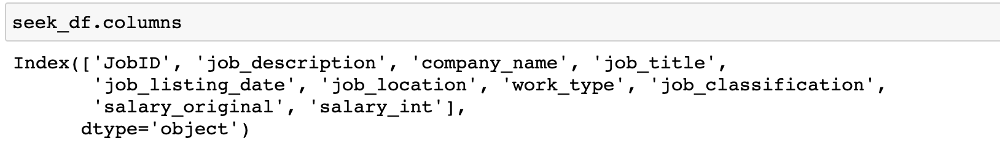
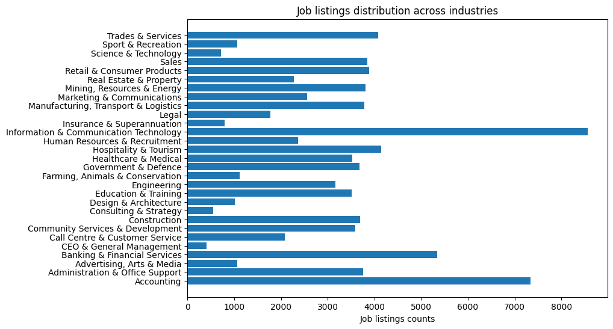
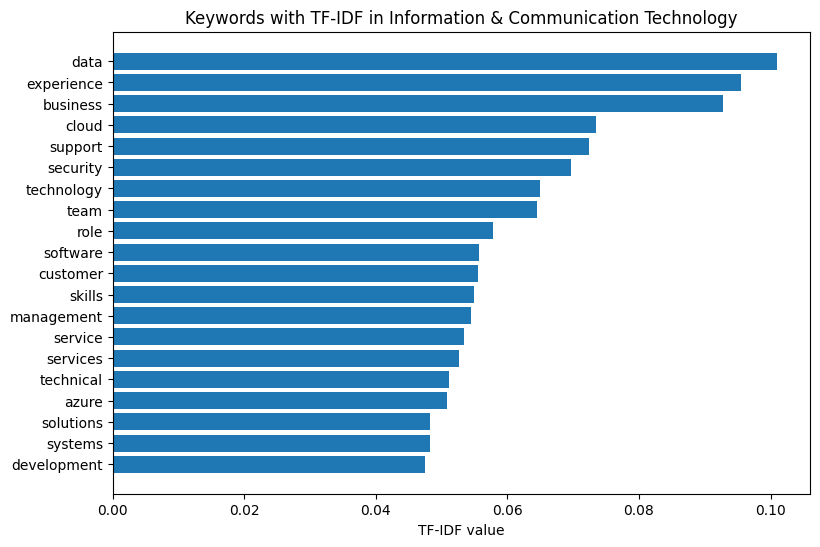
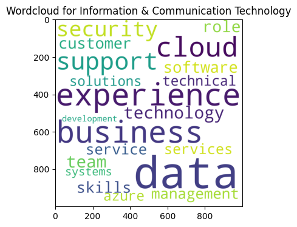
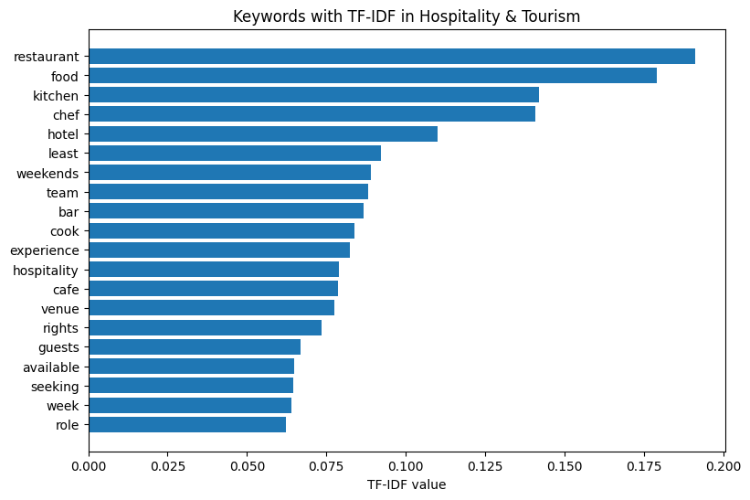
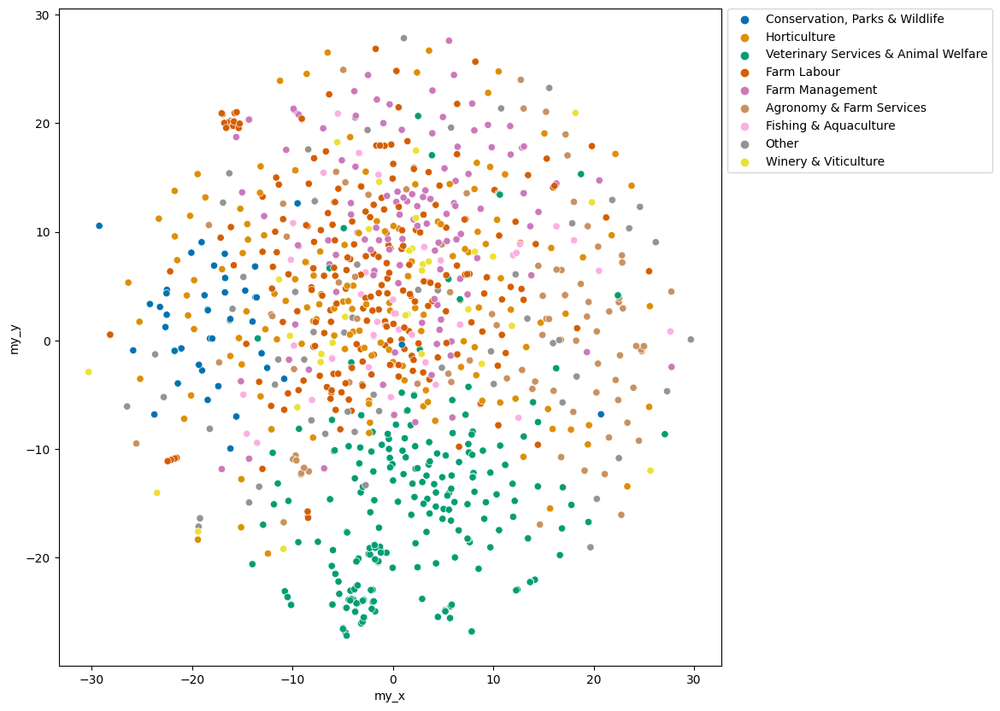
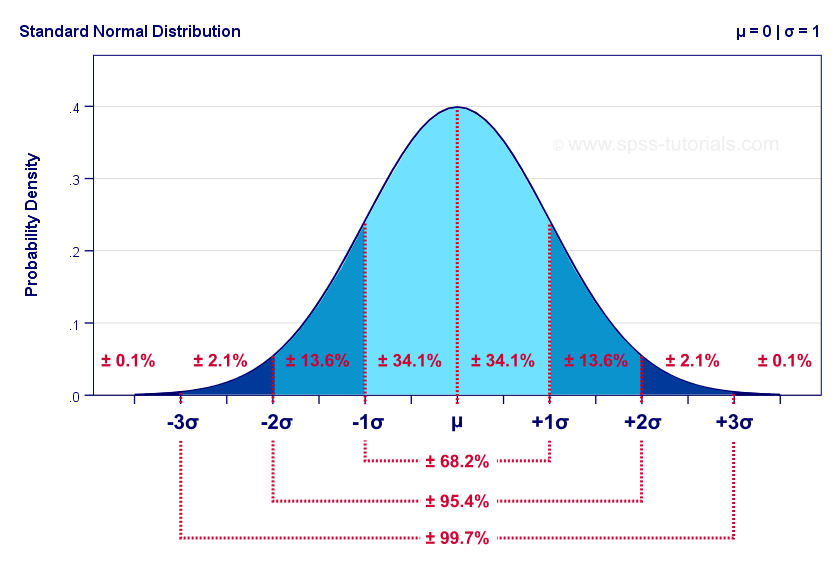

# Summary
In order to make my job hunting experience a bit easier, I decided to conduct analysis on the data scraped from https://www.seek.com.au/ within the last 3 months (2020-10 to 2021-01). The data set I collected contains over 80,000 job listings across 29 industries.
In this project, we're going to look at the following features of the job market in Australia over the last 3 months.
- Words that stand out in each industry 
- Industries that emphasizes certain soft skills, such as teamwork, communication skills and experience.
- Visualizing the job description of different positions of an industry in 2D
- Top hiring companies in an industry
- Most popular jobs in each industry 
- Cities with high demand in an industry
- Given a list of skills, find the 5 best matched job listings 

## Exploring the data
The seek dataset contains 87507 job listings across 29 industries. Each job listing includes job_description, company_name, job_title, job_listing_date, job_location, work_type(Full time / Part time), job_classification and salary. 
- Snapshot of the dataset


- Columns of the dataset


### Job listings distribution across industries


#### Observation
The distribution of job listings across industries is not evenly distributed. However, it's not a big issue here as we're not creating a model whose result is heavily influenced by the data distribution across different categories. Here we mostly focus on the information within an individual industry. 

------------------------------------------------------------------------

## Words that stand out in an industry 
[Reference Article](https://towardsdatascience.com/natural-language-processing-feature-engineering-using-tf-idf-e8b9d00e7e76)

- This section aims at finding the keywords of a given industry and plotting a word cloud. 
- Instead of ranking the importance of a word simply based on its Term Frequency (TF) within the document. We look at the **TF-IDF** value of a word.
- **TF**: The number of times a word appears in a document divided by the total number of words in the document.
- **IDF**: The log of the number of documents divided by the number of documents that contain the word w. Rare words have high IDF, and stop words have low IDF.
- TF-IDF = TF * IDF 
- Why TF-IDF?  
**TF-IDF** quantifies the importance of a word in the document. We want words that occur frequently only in the industry we're investigating, but not in other industries. If we simply use TF, some stop words such as 'the', 'of' may be the most occurring words, but not representative of the industry. IDF for stop words are small, which prevents their TF-IDF from getting big.  
```python
def TF_IDF(documentA, documentB):
    # documentA is a signle doc, documentB is a list of docs, the more the better
    my_list = [documentA, *documentB]
    vectorizer = TfidfVectorizer()
    vectors = vectorizer.fit_transform(my_list)
    feature_names = vectorizer.get_feature_names()
    dense = vectors.todense()
    denselist = dense.tolist()
    df = pd.DataFrame(denselist, columns=feature_names)
    return df
```
### Example A: Keywords in 'Information & Communication Technology'


#### Word cloud version


#### Observation
The word cloud shows that buzzwords in the IT industry are 'data','experience', 'business', 'cloud', etc.

### Example B: Keywords in 'Hospitality & Tourism'


#### Word cloud version


#### Observation
The word cloud shows that buzzwords in Hospitality & Tourism are 'restaurant','food', 'kitchen', 'chef', 'hotel' etc.

-------------------------------------------------------------------------------

## Industries that emphasize soft skills most, such as teamwork, communication skills and experience.
This is done through making use of the keywords in all 29 industries we extracted from the previous section. Unfortunately, due to the limitation of computation resources, I wasn't able to extract the keywords including multi-grams such as 'communication skills' as one word. 
After going though the keywords extracted, I picked the most representative words for soft skills or qualification. 
```python
picked_words = ['team', 'experience', 'skill', 'service','customer','ability','people',
                'client','management','customer','safety',
                'business','client']
``` 
### Example A: Industries that emphasize 'management'

#### Observation
The bar chart shows that 'Real Estate & Property', 'Construction' and 'CEO & General Management' emphasizes management skills a lot.
### Example B: Industries that emphasize 'service'

#### Observation
The bar chart shows that good service is highly emphasized in 'Call Centre & Customer Service', 'Community Services & Development' and 'Information & Communication Technology'. 

---------------------------------------------------------------------------


## Visualizing the job description of different positions in 2D
 - By visualising the job description within one industry, we can understand how different job positions within the same industry overlap with or differ from each other. It allows more flexibility for us when looking for jobs, so that we don't have to be restricted to one or 2 job categories. 

How to do it?
- We convert job description as text to vector using Doc2Vec algorithm, an NLP tool for representing documents as a vector. 
- Reduce the dimension of the vector to 2D for visualisation with TSNE algorithm, a tool to map multi-dimensional data to 2 or more dimensions suitable for human observation.

### Let's try scatter plot the data points 
#### Example: Visualizing different job positions within 'Farming, Animals & Conservation'


#### Observation
There're too many different job positions in an industries, and the scatter plot doesn't make it easy for us to discover the relationship among different job positions. 

### Let's try bubble chart.
- **Centroid** of a bubble: X axis refers to the mean of 1st value in the 2D vector across the jobs in one job category. Y axis refers to the mean of 2nd value in the 2D vector.
- **Radius**: Ideally I want to plot an oval bubble which stretches vertically based on Y, and horizontally based on X, but I couldn't figure it out in Matplotlib. Therefore, I decided to make it a circle, the the radius represents the average of 2 standard deviations on X and 2 standard deviations on Y.
- Why **2 standard deviations** ？



* It's because the radius represents how far the 2D vector of a job category can span. According to normal distribution, data points within 2 standard deviations makes up of 95.4% of the entire data set, which is representative of the data set. 

#### Example A: Visualizing different job positions within 'Farming, Animals & Conservation'


#### Observation:
The bubble chart of 'Farming, Animals & Conservation' shows that jobs in 'Fishing & Aquaculture', 'Horiculture', 'Winery & Viticulture', 'Farm Labor' and 'Farm Management' which are most of labor work cluster together. On the contrary, 'Agronomy & Farm Services', 'Veterinary Services & Animal Welfare' and 'Conservation, Parks & Wildlife' differ from each other and the other industries.

#### Example B: Visualising different job positions within 'Hospitality & Tourism'


#### Observation
Interestingly, 'Bar & Beverage Staff' and 'Waiting Staff' cluster together, which makes sense in real life. 

-------------------------------------------------------------------------------------------

## Top hiring companies in an industry
Let's explore the top hiring companies in an industry.
### Example A: Top hiring companies in Community Services & Development

### Example B: Top hiring companies in Retail & Consumer Products


--------------------------------------------------------------------------------------------

## Most popular jobs in an industry 
Let's have a look at which jobs are the most sought after in the industry.
### Example A: Most sought-after jobs in IT industry

### Example B: Most sought-after jobs in Science & Technology


---------------------------------------------------------------------------------------------

## Cities with high demand in an industry
Let's see which cities have the most job opportunities.

### Example A: Cities with high demand in Mining, Resources & Energy


### Example B: Cities with high demand in Construction


---------------------------------------------------------------------------------------------
## Given a list of skills, find the 5 best matched job listings.
* This is particularly useful, when searching for jobs, you don't want to spend time going through all job listings one by one. 😎 
* Based on your skill set, it returns the 5 best matched latest job postings. 
It returns the ID of the job listings, so that we can search the job listing by URL, e.g. 'https://www.seek.com.au/job/51386461'

```python 
def match_my_skills(industry, my_skills):
    IT_df = select_industry(industry)
    train_corpus = IT_df['job_description'].tolist()
    bigram = get_bigram(train_corpus)
    
    return match_jobs (IT_df, my_skills) 
```
### Scenario: Alexa is looking for work in IT, and she is familiar wth Node, RxJS, Javascript and angular.
```python
my_skills = ['Node','RxJS','Javascript','angular']
matched_jobIDs = match_my_skills("Information & Communication Technology", my_skills)
```


-------------------------------------------------------------------------------------


#### Image Reference
[cover image](https://en.islcollective.com/preview/201411/f/job-hunting_74286_1.jpg)
[standard deviation](https://spss-tutorials.com/img/standard-normal-distribution-with-probabilities.png)


